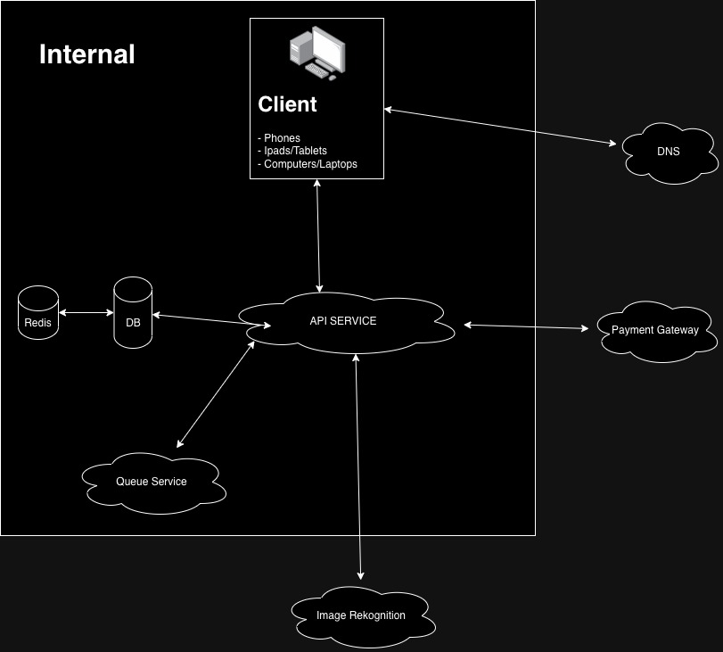

# Project Mfoni

Experimentation.

# Run
> Run both frontend and api simultaneously with make
`make -j 2 run-api run-fe`

## Structure

`apps` - Where our frontend apps live. It's a remix application.

`services` - Where our backend services live. It's a dotnet application

`infrastructure` - Where our terraform/ansible configuration files live.

## Tech Stack + Features

### Frameworks

- [Remix](https://remix.run/) – A web framework that lets you focus on the user interface and work back through web standards to deliver a fast, slick, and resilient user experience.
- [TanStack Query](https://tanstack.com/query/latest/) – Powerful asynchronous state management for TS/JS, React, Solid, Vue and Svelte.
- [Dot Net](https://learn.microsoft.com/en-us/aspnet/core/?view=aspnetcore-8.0) - Learn to use ASP.NET Core to create web apps and services that are fast, secure, cross-platform, and cloud-based. Browse tutorials, sample code, fundamentals, API reference and more.
  
### Platforms

- [Fly.io](https://fly.io/) – Easily deploy staging with actions.
- [AWS](https://aws.amazon.com/) – Amazon Web Services offers reliable, scalable, and inexpensive cloud computing services.

### UI

- [Tailwind CSS](https://tailwindcss.com/) – Utility-first CSS framework for rapid UI development.
- [Framer Motion](https://framer.com/motion) – Motion library for React to animate components with ease.

## System Overview

## Contributing

We love our contributors! Here's how you can contribute:

- [Open an issue](https://github.com/Bendomey/project-mfoni/issues) if you believe you've encountered a bug.
- Make a [pull request](https://github.com/Bendomey/project-mfoni/pulls) to add new features/make quality-of-life improvements/fix bugs.

## Repo Activity

